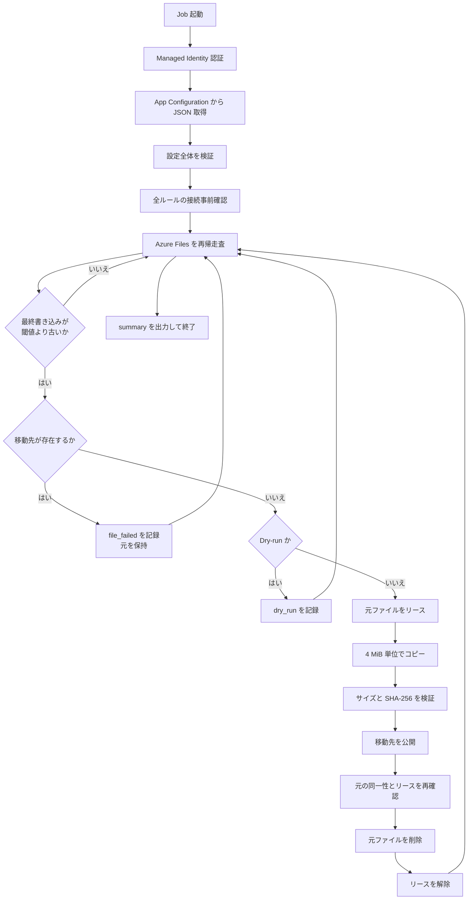

# アプリケーション設計

## 1. 目的

Azure Files の指定パスを走査し、最終書き込みから一定期間が経過したファイルを、
Azure Blob Storage または別の Azure Files 共有へ移動するバッチアプリケーションです。

初期版は 1 回実行して終了するジョブに限定し、Web UI、データベース、進捗台帳、
実行履歴画面、自動再開は実装しません。実行結果は標準出力へ JSON ログとして記録します。

## 2. 技術構成

| 項目 | 採用技術 |
| --- | --- |
| 実行環境 | Node.js 24 |
| 言語 | TypeScript |
| 設定検証 | Zod |
| 設定ストア | Azure App Configuration |
| ファイル操作 | Azure Storage SDK for JavaScript |
| 認証 | ユーザー割り当て Managed Identity |
| コンテナー | `node:24-bookworm-slim`、非 root ユーザー |
| テスト | Node.js Test Runner、Azure SDK モック |

## 3. モジュール構成

| ファイル | 責務 |
| --- | --- |
| `job/src/index.ts` | 認証、App Configuration 読み込み、タイムアウト、シグナル処理、ジョブ起動 |
| `job/src/config.ts` | 設定 JSON のスキーマ検証、ルール間の競合検証 |
| `job/src/engine.ts` | 走査、対象判定、Dry-run、コピー・検証・削除の制御、集計 |
| `job/src/azure-storage.ts` | Azure Files／Blob の SDK 実装、リース、転送、属性処理 |
| `job/src/model.ts` | ストレージ操作を抽象化するインターフェイスと集計モデル |
| `job/src/check-config.ts` | ローカル設定ファイルの事前検証 |

ストレージ固有処理は `RuleStorage`、`LockedFile`、`ArchiveWriter` に分離し、
処理エンジンは Azure SDK の詳細に依存しない構成です。

## 4. 設定設計

App Configuration の 1 キーに、設定 JSON 全体を保存します。

| 項目 | 既定値 |
| --- | --- |
| キー | `archive:settings` |
| ラベル | `production` |
| コンテンツタイプ | `application/json` |

実行開始時に 1 回だけ取得し、厳密なスキーマ検証後にメモリへ保持します。
実行中に App Configuration を更新しても、反映は次回実行からです。

```json
{
  "version": 1,
  "dryRun": true,
  "maxFilesPerRun": 1000,
  "rules": [
    {
      "id": "documents-to-blob",
      "source": {
        "account": "sourcestorage",
        "share": "documents",
        "path": "completed"
      },
      "destination": {
        "kind": "blob",
        "account": "archivestorage",
        "container": "archive",
        "path": "documents",
        "tier": "Cool"
      },
      "olderThanDays": 90
    }
  ]
}
```

### 設定制約

- `version` は `1` 固定です。
- `dryRun` は省略時 `true` です。
- `maxFilesPerRun` は 1～100,000、既定値は 1,000 です。
- ルールは 1～20 件、記載順に実行します。
- ルール ID は一意の英数字、`_`、`-` に限定します。
- アカウント名、共有名、コンテナー名、相対パスを厳密に検証します。
- `..`、`\`、連続 `/`、末尾のドット／空白など、不明確なパスを拒否します。
- 移動元パス同士、同じ移動先内のパス同士の重複を拒否します。
- Files の移動先共有を、別ルールを含む移動元共有として使用できません。
- Blob の移動先ティアは `Hot`、`Cool`、`Cold` のみです。

## 5. 処理フロー



### 対象判定

- 基準日時はジョブ開始時刻です。
- 判定対象は Azure Files の SMB 最終書き込み時刻 `fileLastWriteOn` です。
- `開始時刻 - olderThanDays × 24 時間` より**前**のファイルを対象にします。
- 閾値と同時刻のファイルは対象外です。
- 空ディレクトリは移動・削除しません。
- `maxFilesPerRun` は候補件数の上限です。Dry-run や失敗も候補件数を消費します。

## 6. Dry-run

`dryRun: true` の場合は次の処理のみ行います。

- 全接続先の事前確認
- ファイルの再帰走査
- 最終書き込み時刻による対象判定
- 移動先の存在確認
- `dry_run` ログと集計の出力

リース取得、コピー、属性変更、元ファイル削除は行いません。

## 7. 実移動の安全設計

### 共通

1. 走査時にファイル ID、ETag、サイズ、最終書き込み時刻をバージョン情報として保持します。
2. 元ファイルに無期限リースを取得します。
3. リース取得後に属性を再取得し、走査時から変更されていないことを確認します。
4. 移動先が既に存在する場合は上書きせず、元を保持します。
5. 4 MiB 単位で読み書きし、全ファイルをローカルディスクやメモリへ保持しません。
6. 転送後にサイズと SHA-256 を照合します。
7. 元と移動先の保護状態を再確認してから、元ファイルを削除します。
8. 成否にかかわらずリース解除を試みます。

1 ファイルの上限は 4 MiB × 50,000 ブロック、
**209,715,200,000 バイト（約 195.3 GiB）**です。ファイルは直列処理します。

### Blob への移動

- `If-None-Match: *` で空 Blob を排他的に作成します。
- Blob に無期限リースを取得します。
- 各ブロックに MD5 を付けてアップロードします。
- 検証中は `Hot` で保持し、公開時に設定されたティアへ変更します。
- Content-Type などの HTTP 属性をコピーします。
- 元 URL、作成時刻、最終書き込み時刻、SMB 属性をメタデータへ保存します。
- NTFS ACL は Blob へ適用できないため保持しません。

### Azure Files への移動

- 必要な移動先ディレクトリを作成します。
- 同一親ディレクトリに一意な `.__archive-<UUID>` 一時ディレクトリを排他的に作成します。
- 一時ファイルへ内容をコピーし、無期限リースで保護します。
- 元ファイルの ACL、属性、作成時刻、最終書き込み時刻、HTTP 属性を設定します。
- 検証後、`replaceIfExists: false` で最終パスへ rename します。
- ファイルの ACL は保持しますが、ディレクトリの ACL・属性は複製せず移動先から継承します。

## 8. 競合・障害時の挙動

| 状況 | 挙動 |
| --- | --- |
| 移動先が存在 | 上書きせず `file_failed`、元を保持 |
| 走査後に元が変更 | `changed`、移動しない |
| リース取得失敗 | `file_failed`、元を保持 |
| コピー／検証失敗 | 元を削除せず、移動先とリースを要確認 |
| 上限到達 | `limit_reached`、終了コード 1 |
| 設定・事前接続・走査失敗 | `fatal`、ジョブ中断 |
| 一部ファイルのみ失敗 | 残りのファイル処理を継続 |
| SIGTERM／SIGINT | AbortSignal で中断し、可能な範囲でリース解除 |

進捗を保存しないため、コピー後・元削除前に停止した処理を自動再開しません。
次回実行では移動先の存在を競合として報告します。強制終了や通信断では無期限リースが残る
可能性があり、ジョブ停止確認後に手動復旧が必要です。

## 9. ログ・終了コード

標準出力へ 1 行 1 JSON で出力し、全イベントに UTC 時刻と `runId` を付与します。

| 主なイベント | 内容 |
| --- | --- |
| `started` | Dry-run、ルール数、設定キー・ラベル・ETag |
| `dry_run` | 移動候補 |
| `source_lease_acquire` | 元ファイルのリース取得開始 |
| `archive_create` | 移動先作成開始 |
| `moved` | 移動完了 |
| `changed` | 走査後に元が変更された |
| `file_failed` | ファイル単位の失敗 |
| `limit_reached` | 候補件数上限 |
| `summary` | 走査・候補・移動・失敗件数 |
| `fatal` | ジョブ全体を停止するエラー |

正常終了、対象なし、正常な Dry-run は終了コード 0 です。
ファイル失敗、上限到達、致命的エラーは終了コード 1 です。

## 10. 認証・環境変数

| 環境変数 | 内容 |
| --- | --- |
| `APP_CONFIG_ENDPOINT` | App Configuration の HTTPS endpoint。必須 |
| `APP_CONFIG_KEY` | 既定 `archive:settings` |
| `APP_CONFIG_LABEL` | 既定 `production` |
| `AUTH_MODE` | コンテナーは `managed-identity`、ローカル検証は `azure-cli` |
| `AZURE_CLIENT_ID` | ユーザー割り当て Managed Identity の client ID |
| `JOB_TIMEOUT_SECONDS` | アプリケーション側の実行期限。既定 3,300 秒 |

コンテナーでは開発者資格情報や共有キーへフォールバックしません。

## 11. 対象外

- Web UI
- データベース、進捗台帳、履歴画面
- 自動再開、自動競合解消
- 複数 execution 間の分散ロック
- NFS Azure Files
- `Microsoft.FileShares` の新しい共有リソース
- Blob Archive ティア
- Blob 上での NTFS ACL 保持
- 空ディレクトリの移動・削除

## 12. テスト方針

- 設定の正常系・異常系
- 閾値境界
- Dry-run の読み取り専用性
- Blob／Files SDK 呼び出し契約
- コピー、検証、公開、削除の順序
- 転送・リース・cleanup の障害
- 空ファイル、複数ブロック、キャンセル
- 移動先競合、走査後変更、上限到達

Azure SDK はモックし、ユニットテストでは Azure リソースを変更しません。
Managed Identity、RBAC、ネットワーク、SMB ロック、Files rename は専用 Azure 環境で
Dry-run と受け入れ確認を行います。

