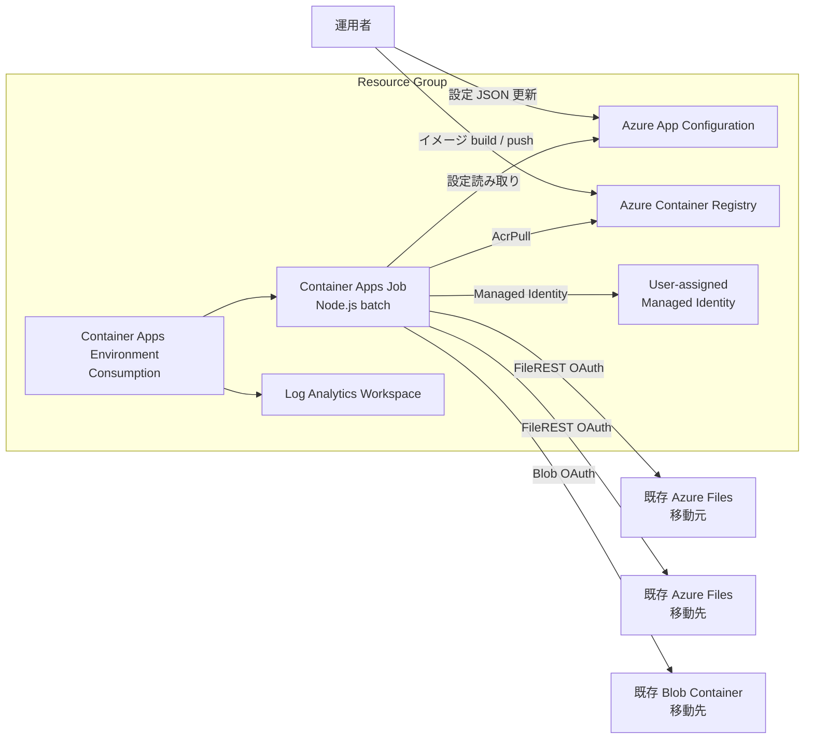
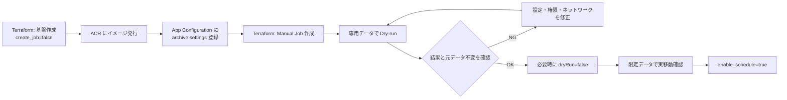

# インフラストラクチャ設計

## 1. 目的

Azure Files アーカイブジョブを、資格情報をコードや設定へ保存せず、
Azure Container Apps Jobs で手動または日次実行するための最小 Azure 基盤です。

Terraform はジョブ実行基盤、イメージ格納、設定ストア、監視、Managed Identity、RBAC を管理します。
処理対象の Storage Account、Azure Files 共有、Blob コンテナーは既存リソースとして扱い、
Terraform では作成・変更しません。

## 2. 論理構成



## 3. Terraform 管理対象

| リソース | 設計 |
| --- | --- |
| Resource Group | 指定名、または `<name_prefix>-rg` |
| Log Analytics Workspace | `PerGB2018`、保持 30 日 |
| Container Apps Environment | Consumption workload profile |
| Azure Container Registry | Basic、管理者認証無効 |
| Azure App Configuration | Free または Standard、ローカル認証無効 |
| User-assigned Managed Identity | Job 実行専用 |
| Container Apps Job | 0.5 vCPU、1 GiB、単一コンテナー |
| RBAC | ACR、App Configuration、Files、Blob の最小対象スコープ |

### Terraform 管理対象外

- 移動元 Storage Account／Azure Files 共有
- 移動先 Storage Account／Azure Files 共有／Blob コンテナー
- App Configuration の `archive:settings` の値
- ACR 内のコンテナーイメージ build
- Storage のネットワーク設定や組織固有タグ
- Log Analytics のアラートルール、通知先

## 4. 命名

`name_prefix` とサブスクリプション ID から固定サフィックスを生成します。

| リソース | 名前 |
| --- | --- |
| Resource Group | `resource_group_name` または `<prefix>-rg` |
| Log Analytics | `<prefix>-logs` |
| Container Apps Environment | `<prefix>-env` |
| Container Apps Job | `<prefix>-job` |
| Managed Identity | `<prefix>-job-mi` |
| ACR | ハイフンを除いた prefix + `acr` + 8 桁サフィックス |
| App Configuration | `<prefix>-config-<8桁サフィックス>` |

同一サブスクリプションと同一 prefix では同じサフィックスを使用します。

## 5. Container Apps Job

### コンピューティング

| 項目 | 値 |
| --- | --- |
| Workload profile | Consumption |
| CPU | 0.5 vCPU |
| メモリ | 1 GiB |
| 並列度 | 1 |
| 完了 replica 数 | 1 |
| Platform retry | 0 |
| 既定 replica timeout | 3,600 秒 |
| 既定アプリ timeout | 3,300 秒 |
| Ingress | なし |

アプリ側 timeout は platform timeout より短くし、SIGTERM 前に cleanup を試行できる余裕を持たせます。

### トリガー

| モード | Terraform 設定 | 動作 |
| --- | --- | --- |
| 基盤のみ | `create_job=false` | Job を作成しない |
| 手動検証 | `create_job=true`, `enable_schedule=false` | Manual Job |
| 日次運用 | `create_job=true`, `enable_schedule=true` | `0 18 * * *` UTC |

日次スケジュールは毎日 18:00 UTC、JST では翌日 03:00 です。
初期 apply は Job を作成せず、イメージと設定の登録後に手動 Job を作成します。
Dry-run 確認後にのみスケジュールを有効化します。

トリガー種別の変更は provider や API の動作により Job の置き換えになる可能性があるため、
実行中の execution がないことと plan を確認して適用します。

## 6. App Configuration

- 設定 JSON 全体を `archive:settings` の 1 キーとして保存します。
- 既定ラベルは `production` です。
- Terraform はストアのみを作成し、設定値を state に保存しません。
- Job は `App Configuration Data Reader` のみを持ちます。
- 指定した運用者には任意で `App Configuration Data Owner` を割り当てます。
- ローカル認証を無効化し、Entra ID 認証を使用します。
- Free は検証・サンプル向けです。本番では Standard と削除保護を検討します。
- Standard の場合、soft-delete 保持期間を 7 日に設定します。
- purge protection は Standard のみ有効化でき、有効化後は不可逆です。

## 7. ACR とイメージ

- ACR Basic を使用します。
- 管理者アカウントを無効化します。
- Job の Managed Identity には `AcrPull` のみを割り当てます。
- イメージ発行者は Entra ID と AcrPush 相当の権限を使用します。
- イメージは `files-archive:<image_tag>` として参照します。
- 同一タグの上書きを避け、リリースごとに不変タグを使用します。
- ローカル Docker が利用できない場合は `az acr build` を使用できます。

## 8. Managed Identity と RBAC

ユーザー割り当て Managed Identity を Job の実行 ID と ACR pull ID に使用します。
接続文字列、Storage Account Key、SAS、App Configuration access key は使用しません。

| 対象 | ロール | スコープ |
| --- | --- | --- |
| ACR | AcrPull | 作成したレジストリ |
| App Configuration | App Configuration Data Reader | 作成したストア |
| 移動元 Azure Files | Storage File Data Privileged Contributor | 指定した共有 |
| 移動先 Azure Files | Storage File Data Privileged Contributor | 指定した共有 |
| 移動先 Blob | Storage Blob Data Contributor | 指定したコンテナー |
| 設定運用者 | App Configuration Data Owner | 作成したストア |

### Azure Files の RBAC スコープ

Terraform 変数には通常の管理プレーン ID を指定します。

```text
.../fileServices/default/shares/<share>
```

FileREST OAuth のデータ操作では `fileshares` スコープが必要なため、
Terraform 内で次へ変換してロールを割り当てます。

```text
.../fileServices/default/fileshares/<share>
```

アカウント全体ではなく共有単位に限定します。
`Storage File Data Privileged Contributor` は NTFS ACL を迂回できる強い権限のため、
Job 専用 ID と対象共有に限定します。

## 9. ネットワーク

現在の最小構成は次の前提です。

- Job は ingress を公開しません。
- Job から ACR、App Configuration、Storage の公開 HTTPS endpoint へ接続します。
- ACR と App Configuration の public network access は有効です。
- 既存 Storage のネットワーク設定は Terraform で変更しません。

Storage firewall や Azure Policy で public network access が無効な場合、
RBAC だけでは接続できません。次のいずれかが必要です。

1. 組織で承認された例外により、対象 Storage への公開接続を許可する。
2. VNet 接続の Container Apps Environment、Private Endpoint、
   Private DNS Zone を含むプライベート構成へ拡張する。

組織固有の除外タグを使う場合は、そのポリシー定義と承認範囲を確認します。
Terraform は組織固有タグや Storage の public network access を自動変更しません。

## 10. ログと監視

- アプリケーションログは標準出力の JSON です。
- Container Apps Environment から Log Analytics へ転送します。
- Log Analytics の保持期間は 30 日です。
- Job の platform ログから image pull、replica 作成、終了コードを確認できます。
- アプリログから設定 ETag、候補、移動、失敗、summary を確認できます。

現状はアラート、ダッシュボード、長期監査保管を Terraform で作成しません。
本番では次を追加検討します。

- Job failure／`fatal`／`file_failed` のアラート
- 実行未発生の監視
- Log Analytics の保持期間とアクセス制御
- Azure Monitor Workbook

## 11. デプロイ手順



### 段階デプロイの理由

- 未発行イメージを参照する Job を作成しないためです。
- 設定未登録の Job が誤実行されることを防ぎます。
- 最初に手動 Dry-run を行い、対象件数とネットワーク／RBAC を確認します。
- 実移動と定期実行を明示的な別段階に分けます。

## 12. Terraform 状態管理

- 現状はローカル state です。
- state、plan、実環境用 tfvars は Git へ追加しません。
- 共同運用では、アクセス制御と state lock を備えた Azure Storage backend 等へ移行します。
- 既存 Resource Group を使用する場合は Terraform state へ import してから apply します。
- App Configuration 値や Storage データは state に保持しません。

## 13. 可用性・拡張性

現状は最小実装で、次の特性があります。

- ファイルは直列処理です。
- Job replica は 1 です。
- Job の platform retry は 0 です。
- 進捗台帳がないため、中断後は共有全体を再走査します。
- 同じ Job の複数 execution を完全には排他制御しません。
- App Configuration Free、ACR Basic、Consumption を採用します。

対象件数や処理時間が増えた場合は、次を検討します。

- ルールまたはディレクトリ単位の分割
- キューを利用したファイル単位の並列化
- PostgreSQL 等の処理台帳
- 再開・重複排除設計
- Dedicated workload profile
- App Configuration Standard
- Private Endpoint と固定送信経路

## 14. セキュリティ方針

- 共有キー、SAS、接続文字列を使用しません。
- Managed Identity と共有／コンテナー単位 RBAC を使用します。
- ACR 管理者認証と App Configuration ローカル認証を無効化します。
- コンテナーは非 root ユーザーで実行します。
- App Configuration に秘密情報を保存しません。
- Job は ingress を持ちません。
- Dry-run を既定とし、実移動とスケジュールは段階的に有効化します。
- 移動先を上書きせず、検証完了前に元ファイルを削除しません。

## 15. 現状の対象外

- Storage Account／共有／コンテナーの Terraform 作成
- Private Endpoint／VNet 統合
- Azure Monitor アラート
- リモート Terraform backend
- マルチリージョン／DR
- Job execution 間の分散排他
- Web UI と設定編集 API
- データベースと実行履歴

